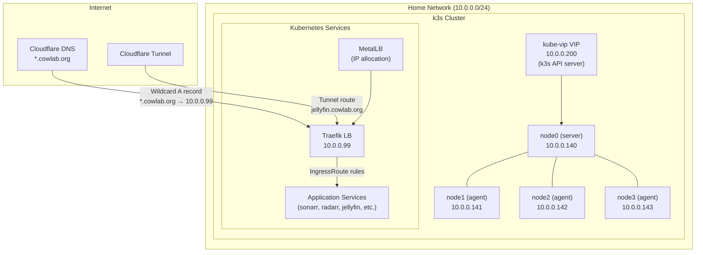

# Cluster Topology

## Hardware

The cluster runs on 4x Raspberry Pi 5 single-board computers, each equipped with an NVMe SSD for storage. All nodes run the `aarch64` (ARM64) architecture.

| Node | Role | IP Address | Hardware |
|------|------|-----------|----------|
| node0 | k3s server (control plane) | 10.0.0.140 | Raspberry Pi 5, aarch64, NVMe SSD |
| node1 | k3s agent (worker) | 10.0.0.141 | Raspberry Pi 5, aarch64, NVMe SSD |
| node2 | k3s agent (worker) | 10.0.0.142 | Raspberry Pi 5, aarch64, NVMe SSD |
| node3 | k3s agent (worker) | 10.0.0.143 | Raspberry Pi 5, aarch64, NVMe SSD |

## Operating System

All nodes run **NixOS** (unstable channel), managed in a separate repository ([rpi5-nixos](https://github.com/myles-coleman/rpi5-nixos)). Key OS-level configuration:

- **k3s v1.33** — lightweight Kubernetes distribution
- **open-iscsi** — required by Longhorn for distributed block storage
- **Disabled k3s defaults** — `servicelb` and `traefik` are disabled in favor of MetalLB and a custom Traefik deployment

## Network Layout

### Key Network Components

- **kube-vip (10.0.0.200)** — Virtual IP for the k3s API server, providing a stable endpoint for `kubectl` and agent registration
- **MetalLB** — Bare-metal load balancer that assigns external IPs to `LoadBalancer`-type services
- **Traefik (10.0.0.99)** — Ingress controller and reverse proxy. All HTTP(S) traffic enters the cluster through this IP
- **Cloudflare DNS** — Wildcard `*.cowlab.org` resolves to 10.0.0.99. Additional A/CNAME records exist for services outside the cluster (pihole, pikvm, vaultwarden, etc.)
- **Cloudflare Zero Trust Tunnel** — Provides public internet access to select services (currently `jellyfin.cowlab.org`) without exposing any ports on the home network

### Traffic Flow

1. External request for `<service>.cowlab.org` resolves via Cloudflare DNS to `10.0.0.99`
2. Traefik receives the request on the `websecure` (443) entrypoint
3. Traefik matches the `Host()` rule in the service's `IngressRoute`
4. Traefik forwards the request to the Kubernetes Service
5. The Service routes to the appropriate pod(s)

For public-facing services via Cloudflare Tunnel:

1. Request hits Cloudflare's edge network
2. Cloudflare Tunnel routes it to `traefik.traefik.svc.cluster.local:80` inside the cluster
3. Traefik processes the request as normal
