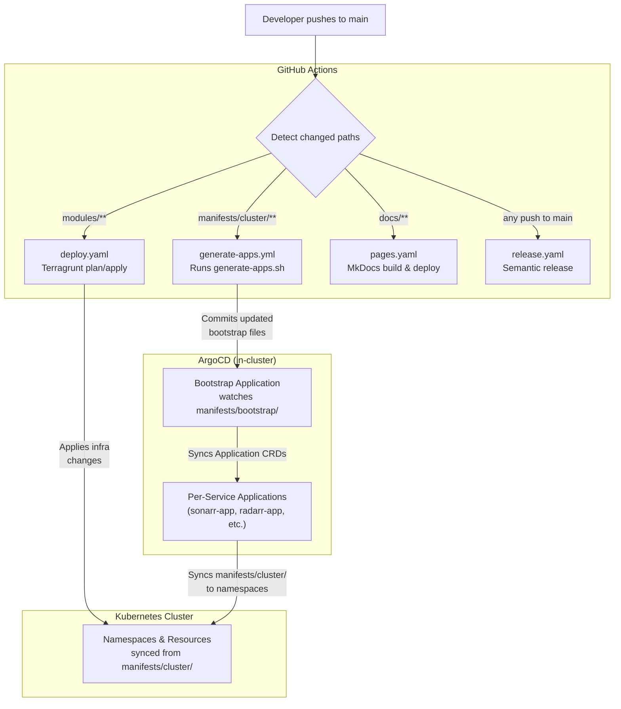

# GitOps Deployment Flow

## Overview

This cluster uses a GitOps model: the Git repository is the single source of truth for all Kubernetes resources. ArgoCD continuously reconciles the cluster state to match what's defined in Git.

## Deployment Pipeline

## ArgoCD Bootstrap Chain

The cluster uses a layered bootstrap approach to manage all services through ArgoCD:

1. **`argocd-install`** (Terragrunt module) — Installs ArgoCD via Helm chart into the `argocd` namespace
2. **`argocd-configure`** (Terragrunt module) — Creates a "bootstrap" ArgoCD Application resource that points to `manifests/bootstrap/`
3. **Bootstrap Application** — ArgoCD reads `manifests/bootstrap/kustomization.yaml`, which lists all individual `*-app.yaml` files
4. **Per-service Applications** — Each `*-app.yaml` is an ArgoCD Application that syncs the corresponding `manifests/cluster/<service>/` directory to the cluster

### How Applications Are Generated

The `generate-apps.sh` script reads `manifests/cluster/kustomization.yaml` and generates an ArgoCD Application YAML for each listed service. It handles:

- **Namespace mapping** — defaults to the service directory name, unless overridden in `namespace_map` (e.g., `metallb` → `metallb-system`)
- **Sync wave assignment** — defaults to wave 10, unless overridden in `sync_wave_map`

This script runs automatically via the `generate-apps.yml` GitHub Actions workflow whenever files in `manifests/cluster/` change.

## Sync Wave Ordering

ArgoCD deploys services in wave order (lower numbers first). This ensures dependencies are ready before dependents start:

| Wave | Services | Rationale |
|------|----------|-----------|
| 0 | external-secrets | Secrets must be available for all other services |
| 1 | cert-manager | TLS certificates needed for ingress |
| 2 | traefik, metallb | Networking layer (ingress + load balancer) |
| 3 | longhorn | Storage layer for persistent workloads |
| 4 | dex | Authentication (OIDC for ArgoCD) |
| 10 | All application workloads | Default wave for apps (sonarr, radarr, jellyfin, etc.) |

See [Sync Wave Reference](../reference/sync-wave-reference.md) for detailed documentation.

## ArgoCD Sync Policy

All applications are configured with:

- **Automated sync** — Changes in Git are automatically applied to the cluster
- **Prune** — Resources removed from Git are deleted from the cluster
- **Self-heal** — Manual changes to cluster resources are automatically reverted to match Git
- **Retry** — 5 retries with exponential backoff (30s initial, 2m max)

## GitHub Actions Workflows

| Workflow | Trigger | Purpose |
|----------|---------|---------|
| `generate-apps.yml` | Changes to `manifests/cluster/**` | Runs `generate-apps.sh` to regenerate ArgoCD Application YAMLs |
| `deploy.yaml` | Changes to `modules/**` | Terragrunt plan (on PR) / apply (on merge to main) |
| `pages.yaml` | Changes to `docs/**` | Builds MkDocs and deploys to GitHub Pages |
| `release.yaml` | Any push to `main` | Semantic release (versioning + changelog) |

### Terraform/Terragrunt CI Pipeline

The `deploy.yaml` workflow handles infrastructure-as-code changes:

- **On pull request** — Runs `terragrunt plan` for review (no changes applied)
- **On merge to main** — Runs `terragrunt apply` to make changes
- **Network access** — Uses Tailscale VPN to reach the cluster from CI
- **State management** — Uses AWS OIDC for S3 state bucket access (no static credentials)
